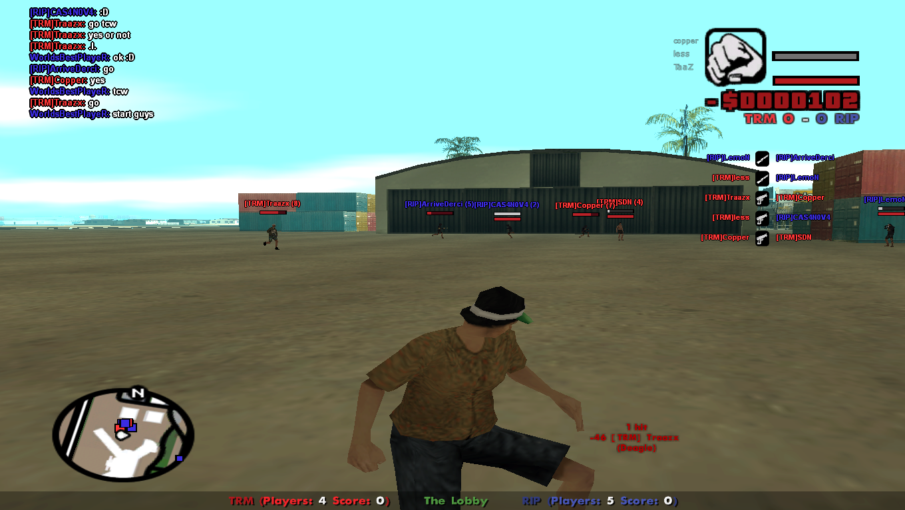

# ChoraNaum

GTA San Andreas Multiplayer (SA:MP) AAD style gamemode programmed in Pawn.

This versión was intended for SAMP versión 0.3e

## Whats AAD?

Attackers and Deffenders (AAD) is a gameplay mode for sa:mp and a comunity of players who play a counter-strike like team competition game. Two teams of a few number of players compete with eachoder, one trying to deffend their base and the other team trying to invade it. Both teams can also win by eliminating all the enemy team members.

## Credits
This gamemode is based on 'ultm' by Lake and almost completly remade by me. I used this as a mean to learn programming trying to update an older public version that was just barely playable to a more powerfull tool for playing AAD matches.  
Testers: Copper, LazT, fryze, LouK JoseGans and Cocoloco. Thanks for helping me!
